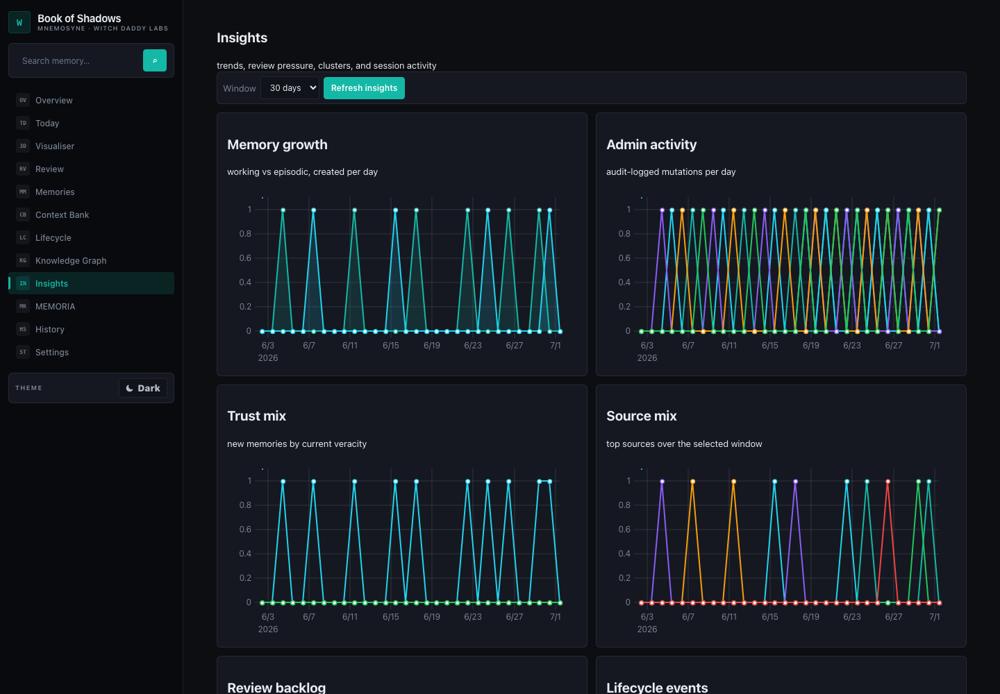
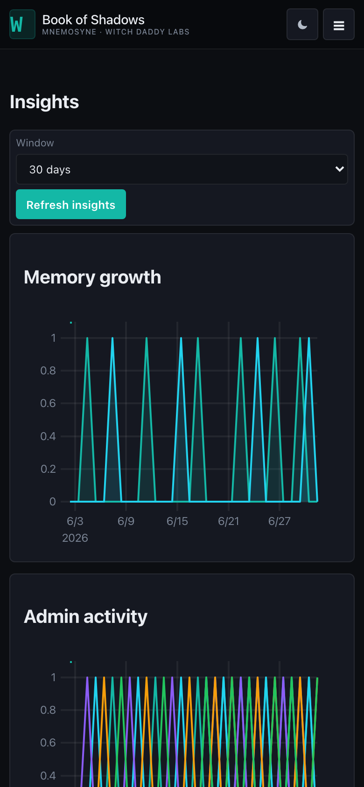

# Book of Shadows

**A cozy little window into your Hermes Agent's memory, by [Witch Daddy Labs](https://github.com/cre8tivoz).**

Your Hermes Agent remembers things about you — preferences, facts, whole conversations — in a memory system called Mnemosyne. Book of Shadows is the dashboard that lets you actually *see* that memory: browse it, watch it grow, and gently tidy it up when something's wrong. Everything runs on your own machine. Nothing leaves your network unless you want it to.


## Plays nicely with Hermes Agent

Book of Shadows is built as a plugin for [Hermes Agent](https://github.com/NousResearch/hermes-agent), the AI agent from Nous Research that remembers you across conversations and can be extended with plugins like this one. If you're already running Hermes, it drops straight in — a couple of commands in your terminal, and you've got a dashboard for the memory your agent has been quietly building up.

You don't *have* to be running Hermes to use it, either — point it at any compatible Mnemosyne SQLite database and it'll happily run standalone. But the two were made for each other.

## What is this, really?

Under the hood it's intentionally small and boring, in the best way: a plain Python server with no heavy framework, and a static HTML/CSS/JS frontend with no sprawling dependency tree. When you open it, it reads your memory database in **read-only** mode by default — nothing gets touched just by browsing. If you want to make changes, you can turn on an optional password-protected admin mode, and even then it can never hard-delete anything or overwrite content. The most it can do is mark something as expired, retire a duplicate, or nudge how important a memory is — and every one of those actions gets backed up and logged automatically.

## Themes

Dark mode uses iron-charcoal surfaces with teal accents. Light mode is warm bone with dark teal. Both are easy on the eyes for late-night tinkering sessions.


## What you can do with it

- **Overview** — the big picture: how many memories you have, what kind, what's been happening lately
- **Today** — a friendly daily digest of what got added, recalled, or tidied up
- **Context Bank** — the patterns and context your agent has picked up about you
- **Insights** — charts you can actually click on: memory growth over time, admin activity, how often things get recalled
- **Visualiser** — a constellation/neural-map view of your memories you can click through and explore
- **Visualiser 3D** — the same idea, rendered in 3D, for the GPU-curious
- **Memories** — the full browser: search, filter, sort, bulk-tidy, debug recall
- **History** — a timeline of everything, grouped by day or by conversation
- **Knowledge Graph** — the facts and relationships your agent has extracted, as an actual graph you can click around
- **MEMORIA** — structured facts, timelines, instructions, and preferences it's learned about you
- **Settings** — password protection, server setup, health diagnostics, backups

## Getting it running

If you're already on Hermes, this is the easy path:

```bash
hermes plugins install cre8tivoz/mnemosyne-dashboard --enable
hermes gateway restart
```

That's it — Hermes handles the rest, and the dashboard will be ready the next time you open your gateway.

Prefer to do it by hand? That works too:

```bash
git clone https://github.com/cre8tivoz/mnemosyne-dashboard.git ~/.hermes/plugins/mnemosyne-dashboard
hermes plugins enable mnemosyne-dashboard
hermes gateway restart
```

## Running it on its own

No Hermes install handy? You can run the dashboard directly:

```bash
python server.py --host 0.0.0.0 --port 8765
```

Then open `http://127.0.0.1:8765/` in your browser and you're in.

## Your memories are safe with this thing

We built this so you could hand it to someone nervous about "an app touching my data" and watch them relax:

- It's reachable from other devices on your home network by default (handy for checking in from your phone), but it never reaches out anywhere beyond that
- Browsing your memories opens the database in strict read-only mode — the dashboard *cannot* write to it just because you're looking around
- Turning on admin mode requires a password you choose yourself, and it's switched off by default
- Even in admin mode, the only actions available are marking something superseded or expired, or adjusting its importance — there's no delete button, and no way to overwrite content
- Every admin action is automatically backed up and written to an audit log, so you can always see what changed
- Standard web-security headers are all in place — no clickjacking, no content-type sniffing tricks, a sensible referrer policy
- The server only ever serves files from its own `static/` folder, so there's no sneaking outside it

## Screenshots

All screenshots are generated from a temporary mock database — no real memory data, no real file paths, no private information.

|  |  |
|---|---|
| Dark theme overview | Light theme overview |

|  |  |
|---|---|
| Constellation visualiser | Search results |

|  |  |
|---|---|
| Insights charts | Mobile insights |

|  |  |
|---|---|
| Knowledge graph (light theme) | Mobile dark overview |

Want to regenerate the whole gallery yourself? One command, using the same mock data:

```bash
python3 scripts/generate_mock_screenshots.py
```

More detail lives in [docs/DEMO_DATA.md](docs/DEMO_DATA.md).

## Tinkering on the code

Want to poke around under the hood or send a fix? Welcome aboard — here's how to check your work before opening a PR:

```bash
python -m pytest tests/ -q
python -m compileall -q .
npm install
npm run build:frontend
npm run test:frontend
node --check static/app.js
```

For fuller release notes, see:

- [Setup](docs/SETUP.md)
- [Architecture](docs/ARCHITECTURE.md)
- [Accessibility notes](docs/ACCESSIBILITY.md)
- [Frontend testing](docs/FRONTEND_TESTING.md)
- [Release checklist](docs/RELEASE_CHECKLIST.md)

## Credits

- **Design** — Witch Daddy Labs
- **Original dashboard** — [wysie](https://github.com/wysie)
- **Mnemosyne, the memory engine this reads from** — [AxDSan](https://github.com/AxDSan)
- **Built to plug into** — [Hermes Agent](https://github.com/NousResearch/hermes-agent) by Nous Research

Thanks to everyone building the ecosystem this sits on top of.
