# Mnemosyne Dashboard

A local-first web dashboard for browsing, visualising, and safely maintaining a Mnemosyne memory store from Hermes Agent.

It is intentionally small: Python standard library server, static HTML/CSS/JS frontend, no external JS runtime, no cloud calls, and read-only browsing by default. Optional password-gated maintenance mode supports safe Mnemosyne-style memory supersession/expiry without hard deletes or raw overwrite edits.

## Screenshots

The screenshots below are generated from a synthetic mock Mnemosyne database. They do not contain private memory data.

| Desktop | Mobile |
| --- | --- |
| 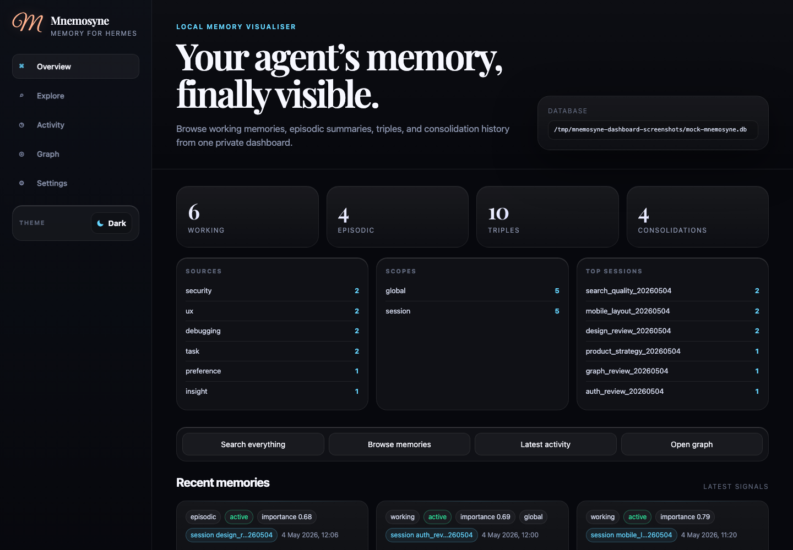 | 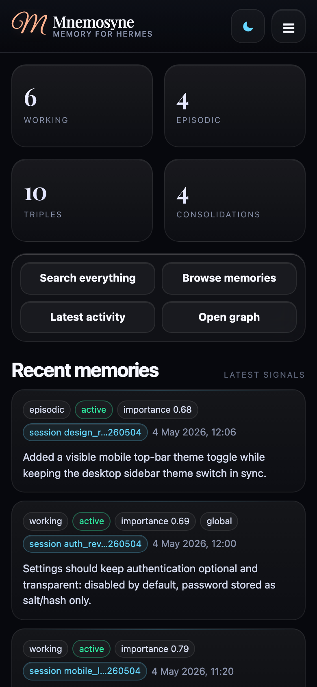 |
| 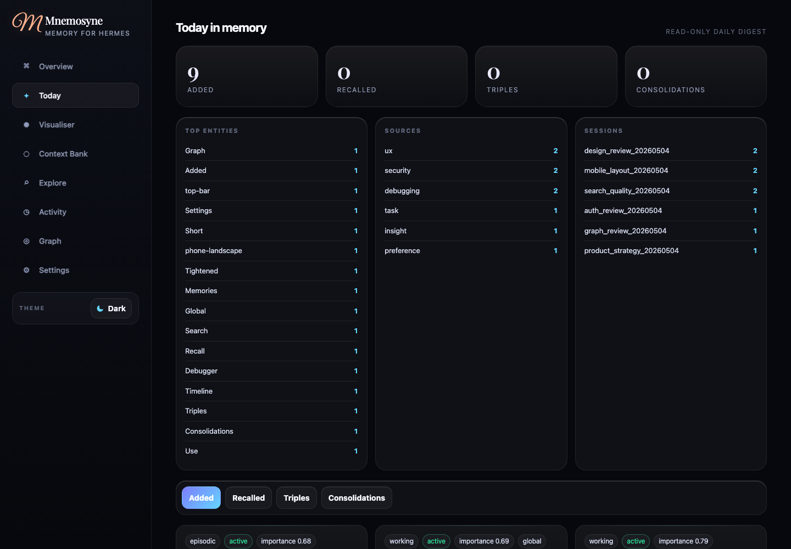 | 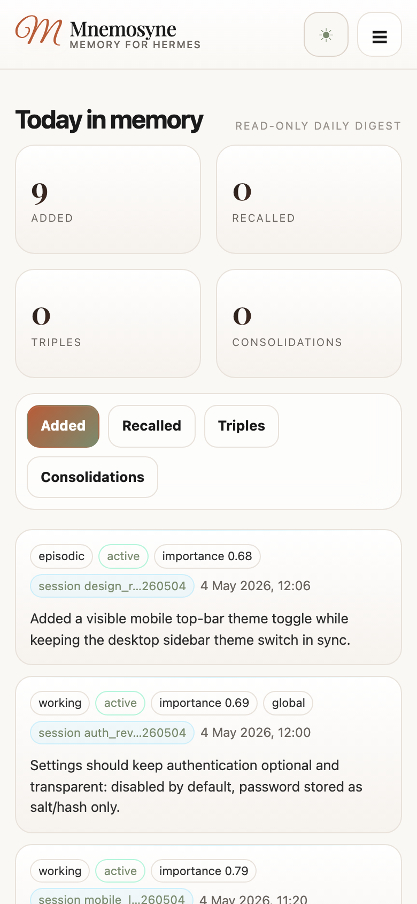 |
| 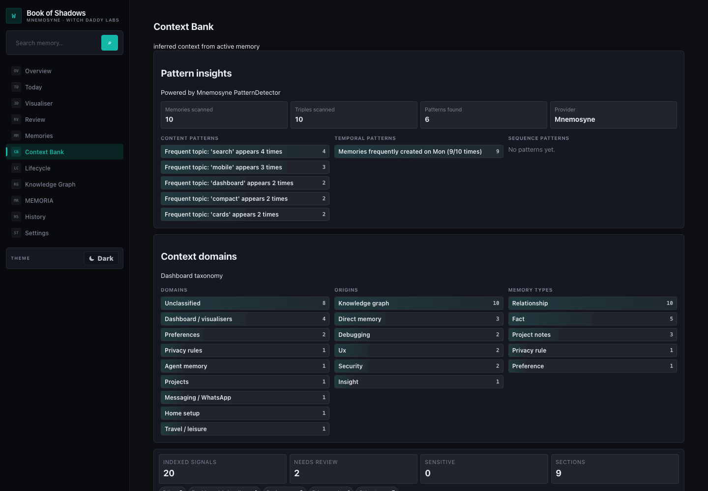 | 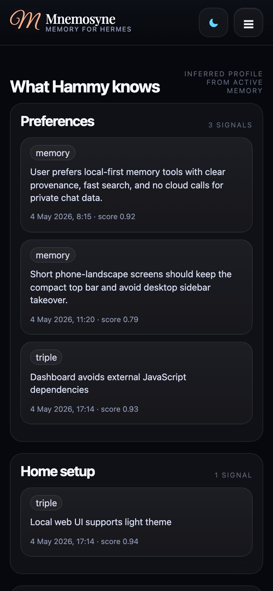 |
| 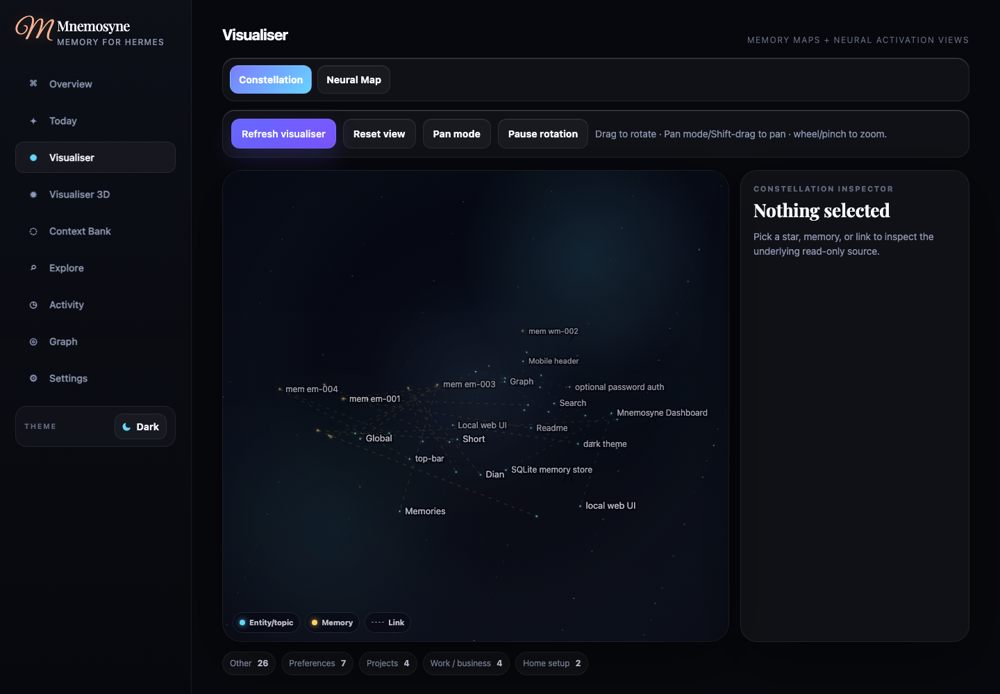 | 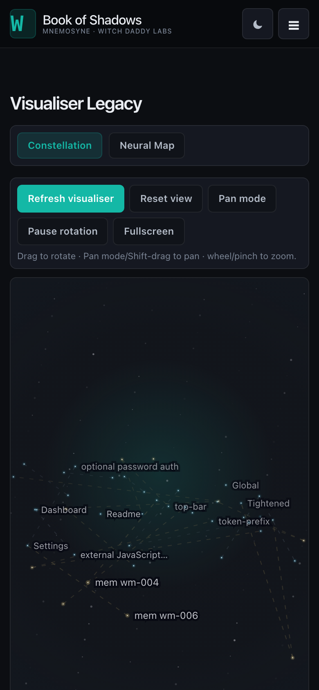 |
| 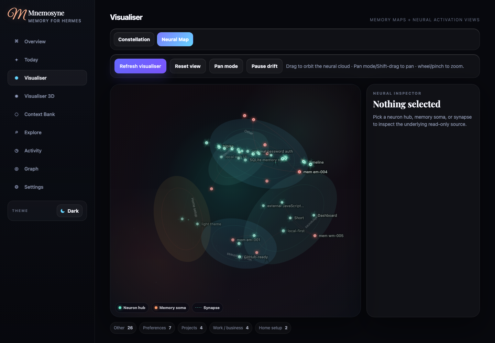 | 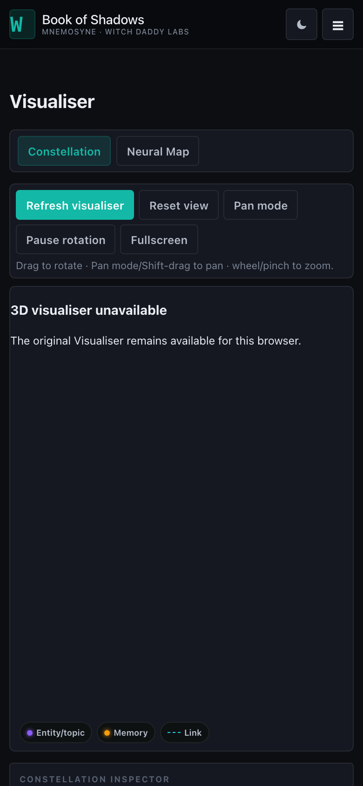 |
| 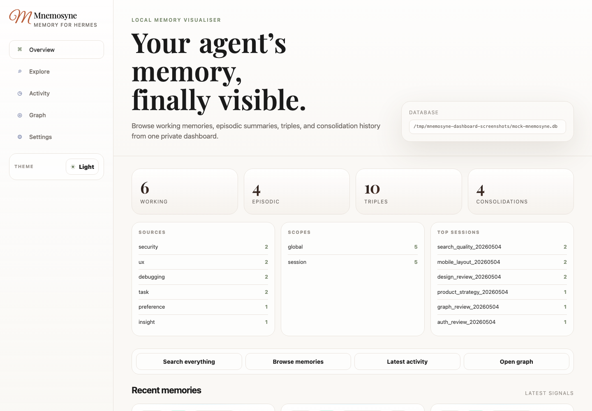 | 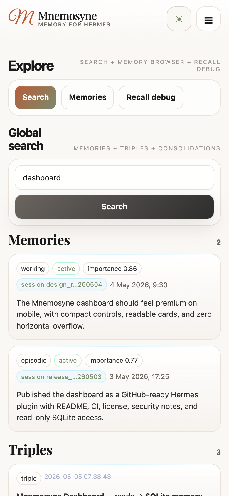 |
| 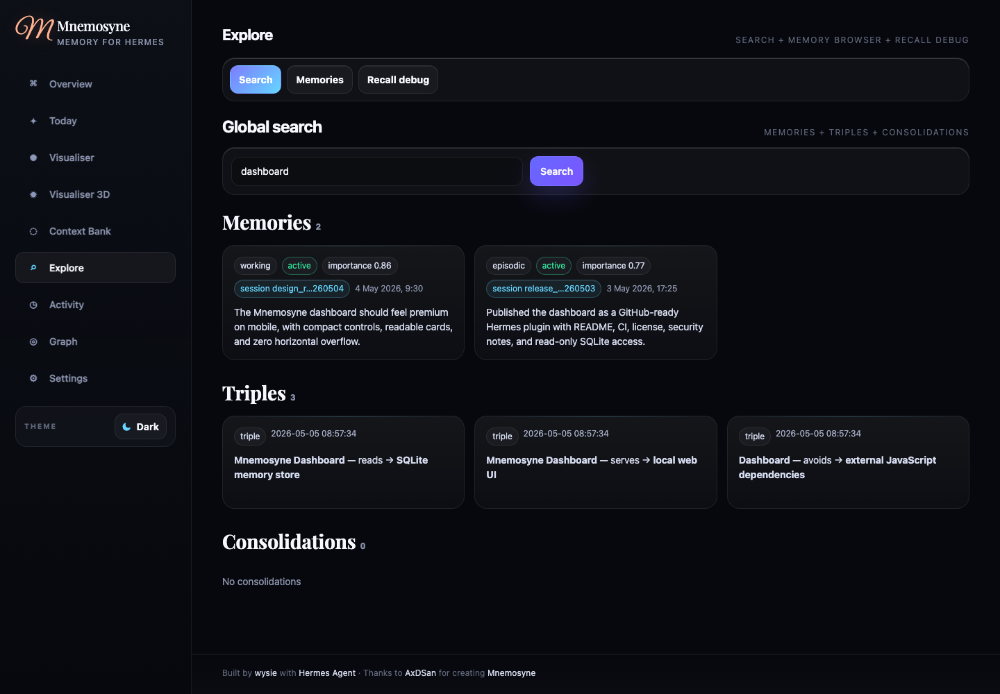 | 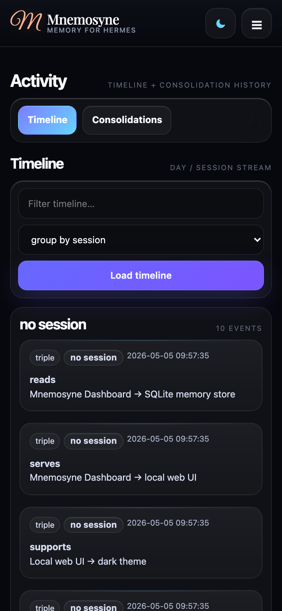 |
| 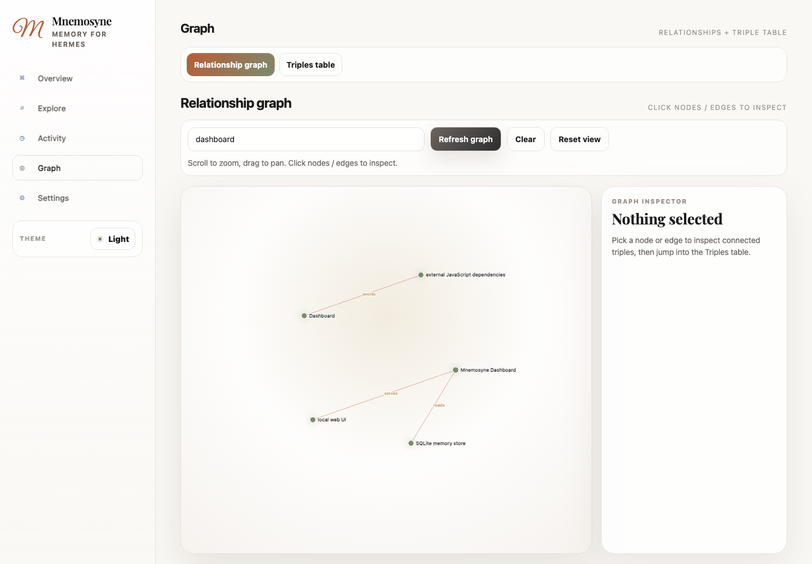 | 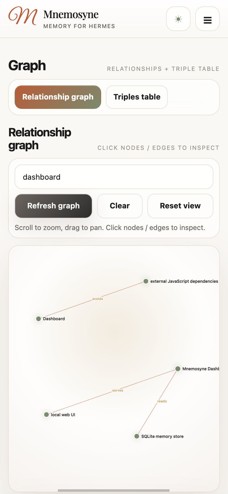 |
| 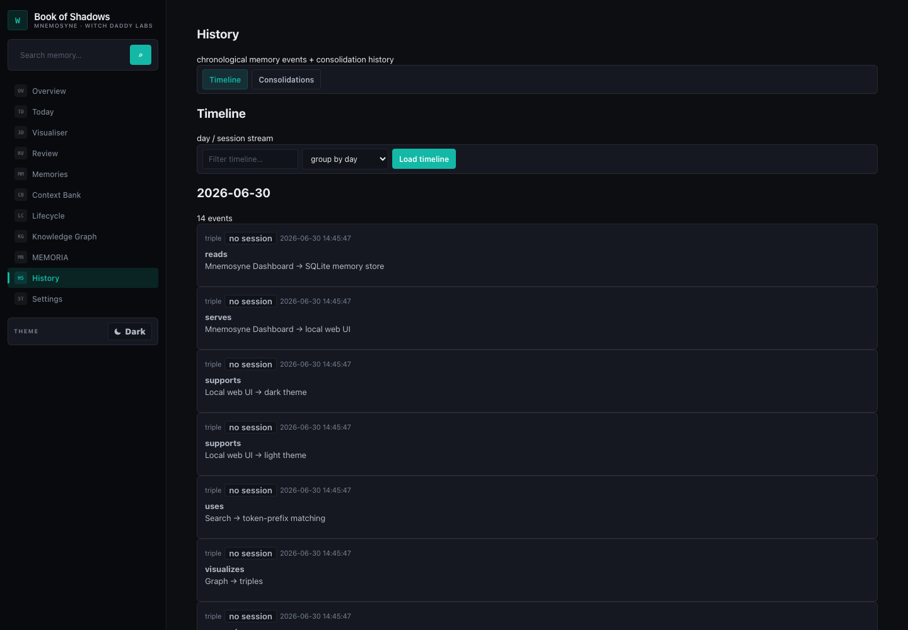 | 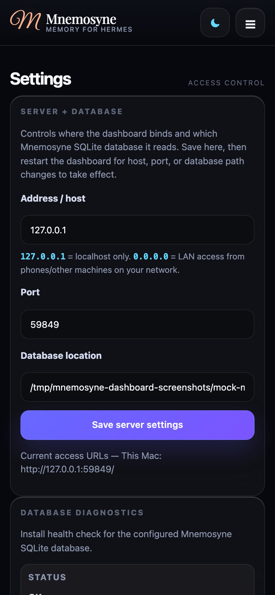 |

Regenerate the gallery locally with:

```bash
python3 scripts/generate_mock_screenshots.py
```

The generator creates a temporary mock SQLite database, starts the dashboard on a random localhost port, captures desktop/mobile viewports in dark and light themes, and writes the images to `docs/screenshots/`.

## Features

- Read-only Memory Intelligence views:
  - Today — daily digest of memories added/recalled, triples, consolidations, entities, sources, and sessions
  - Context Bank — inferred context sections derived from active memories and triples without writing back
  - Visualiser — selectable Constellation and Neural Map views with click-through read-only inspectors
  - Visualiser 3D — separate Three.js/WebGL comparison lab for GPU-rendered Constellation and Neural Map prototypes
- Nine-section product navigation instead of raw database tabs:
  - Overview — counts, breakdowns, quick actions, and recent memories
  - Today — read-only daily memory digest
  - Context Bank — inferred context from active memory
  - Visualiser — Constellation and Neural Map memory visualisers
  - Visualiser 3D — Three.js/WebGL Constellation and Neural Map comparison page
  - Explore — global search, memory browser, and recall debugger
  - Activity — timeline and consolidation history
  - Graph — relationship graph and triples table
  - Settings — optional password authentication and server/database config
- Overview counts for working memory, episodic memory, triples, and consolidations
- Recent memory cards with raw JSON detail drawer
- Clickable overview breakdown rows and quick actions that jump into filtered workflows
- Explore section:
  - Global search across memories, triples, and consolidations
  - Memory browser with query, tier/source/scope/session/status filters, sorting, URL deep links, bulk selection, and safe bulk maintenance
  - Recall debugger with approximate ranking explanations
- Activity section:
  - Mini timeline grouped by day or session
  - Consolidation history with filtering, JSON inspection, and jump-to-session memories
- Graph section:
  - Interactive relationship graph with query filtering, mouse-wheel zoom, drag-to-pan, and reset view
  - Clickable nodes and edges
  - Inspector panel with jumps into Triples and Memories
  - Triples table with clickable row details
- Optional password authentication, configurable from the Settings tab
- Password-gated memory maintenance mode with supersede, expire/invalidate, and importance update actions
- Automatic SQLite backups and JSONL audit log for admin memory mutations
- Editable Settings fields for bind address, port, and Mnemosyne database path
- Database diagnostics for install health: path, readability, file size, modified time, tables, row counts, and copyable diagnostics
- Unified session detail drawer from top sessions, consolidation entries, and timeline session chips
- Desktop and mobile responsive layouts
- Dark and light themes
- Mnemosyne-inspired light theme with self-hosted fonts/assets
- `/api/health` endpoint for smoke checks and uptime probes
- Baseline browser security headers and hardened static asset serving

## Safety model

- Binds to `0.0.0.0` by default so the dashboard is reachable on your LAN
- Reports a localhost URL for same-machine access and a LAN URL when one is detectable
- Browsing opens the Mnemosyne SQLite database with `mode=ro`
- Localhost-only memory admin can be enabled without password for developer convenience; LAN/non-local admin mode requires password auth before mutation endpoints work
- Admin actions are limited to Mnemosyne-aligned supersede, expire/invalidate, and importance updates
- Raw memory content overwrite and hard delete endpoints are intentionally not exposed
- Admin mutations create a SQLite backup by default and append to `audit.jsonl`
- Optional password auth is disabled by default and can be enabled from Settings
- No external JavaScript or CSS dependencies
- Runtime state lives under `~/.hermes/plugin-data/mnemosyne-dashboard/`
- On macOS, run it as a separate LaunchAgent with `KeepAlive=true` if you want the dashboard to survive Hermes gateway restarts
- Static assets are resolved under `static/` before serving; path escapes are rejected
- Browser responses include CSP, no-sniff, frame-deny, and no-referrer headers

By default, the dashboard is reachable from your LAN. Treat that as exposing local memory metadata to your network. Memory admin/editing remains disabled by default; if you expose admin mode on LAN/non-local hosts, password auth is required before mutation endpoints work. Put the dashboard behind a firewall/VPN/reverse proxy auth if needed.

## Installation as a Hermes directory plugin

Copy or clone this directory to:

```text
~/.hermes/plugins/mnemosyne-dashboard
```

Enable it:

```bash
hermes plugins enable mnemosyne-dashboard
```

Restart the running Hermes process so plugin tools are discovered.

## Hermes tools

The plugin registers:

- `mnemosyne_dashboard_start`
- `mnemosyne_dashboard_stop`
- `mnemosyne_dashboard_status`
- `mnemosyne_dashboard_config`

Example tool arguments:

```json
{
  "host": "0.0.0.0",
  "port": 9876,
  "db_path": "/Users/you/.hermes/mnemosyne/data/mnemosyne.db"
}
```

Changing host/port/db_path requires stopping and starting the dashboard process again.

## Configuration

Default config file:

```text
~/.hermes/plugin-data/mnemosyne-dashboard/config.json
```

Default config:

```json
{
  "host": "0.0.0.0",
  "port": 8765,
  "db_path": "~/.hermes/mnemosyne/data/mnemosyne.db",
  "auth_enabled": false,
  "memory_admin_enabled": false
}
```

On first config creation, the dashboard auto-detects the Mnemosyne SQLite database path by checking `MNEMOSYNE_DASHBOARD_DB`, `MNEMOSYNE_DB_PATH`, `MNEMOSYNE_DB`, then the standard Hermes path `~/.hermes/mnemosyne/data/mnemosyne.db`.

You can update it through the Hermes tool:

```json
{
  "host": "0.0.0.0",
  "port": 9876
}
```

Or edit JSON directly, then restart the dashboard.

Environment overrides are also supported:

- `MNEMOSYNE_DASHBOARD_CONFIG` — alternate config file path
- `MNEMOSYNE_DASHBOARD_HOST` — bind address
- `MNEMOSYNE_DASHBOARD_PORT` — bind port
- `MNEMOSYNE_DASHBOARD_DB` — SQLite DB path
- `MNEMOSYNE_DB_PATH` / `MNEMOSYNE_DB` — also considered during first-run DB auto-detection

## Manual run

```bash
python server.py --host 0.0.0.0 --port 8765
```

Bind to localhost only:

```bash
python server.py --host 127.0.0.1 --port 8765
```

Open locally:

```text
http://127.0.0.1:8765/
```

If bound to `0.0.0.0`, use your machine’s LAN IP from another device, e.g.:

```text
http://192.168.1.10:8765/
```

## Optional macOS launchd auto-restart

If you want the dashboard to survive Hermes gateway restarts or plugin-owned process shutdowns, run it as a separate macOS LaunchAgent instead of starting it from inside the Hermes gateway process.

The helper below writes `~/Library/LaunchAgents/<label>.plist` with `RunAtLoad=true` and `KeepAlive=true`, then bootstraps it into the current GUI session:

```bash
cd ~/.hermes/plugins/mnemosyne-dashboard
MNEMOSYNE_DASHBOARD_LAUNCHD_LABEL=io.example.mnemosyne-dashboard \
MNEMOSYNE_DASHBOARD_HOST=127.0.0.1 \
MNEMOSYNE_DASHBOARD_PORT=8765 \
bash scripts/install_launchd_macos.sh
```

Useful service commands:

```bash
LABEL=io.example.mnemosyne-dashboard
PLIST=~/Library/LaunchAgents/$LABEL.plist

# Restart without unloading the service
launchctl kickstart -k gui/$(id -u)/$LABEL

# Full reload after changing the plist
launchctl bootout gui/$(id -u) "$PLIST" 2>/dev/null || true
launchctl bootstrap gui/$(id -u) "$PLIST"
launchctl kickstart -k gui/$(id -u)/$LABEL

# Status, listener, and smoke check
launchctl print gui/$(id -u)/$LABEL | head -80
lsof -nP -iTCP:8765 -sTCP:LISTEN
curl -fsSI http://127.0.0.1:8765/ | head
```

Keep the bind host as `127.0.0.1` unless you explicitly want LAN access to memory metadata.

## Development

```bash
cd ~/.hermes/plugins/mnemosyne-dashboard
~/.hermes/hermes-agent/venv/bin/python -m ruff check .
~/.hermes/hermes-agent/venv/bin/python -m pytest -q
~/.hermes/hermes-agent/venv/bin/python -m compileall -q .
node --check static/app.js
```

Restart the dashboard after backend/server changes:

```bash
~/.hermes/hermes-agent/venv/bin/python - <<'PY'
import importlib.util, pathlib
p=pathlib.Path.home()/'.hermes/plugins/mnemosyne-dashboard/__init__.py'
spec=importlib.util.spec_from_file_location('mnemo_dash', p)
mod=importlib.util.module_from_spec(spec); spec.loader.exec_module(mod)
print(mod._stop({}))
print(mod._start({}))
PY
```

## Repository layout

```text
plugin.yaml
__init__.py              # Hermes tool registration + process lifecycle
config.py                # Config file/env/default resolution
server.py                # ThreadingHTTPServer + API/static routes
dashboard_core.py        # Read-only SQLite access
tests/                   # pytest coverage for core/config behavior
static/                  # HTML/CSS/JS/fonts
.github/workflows/ci.yml # GitHub Actions smoke tests
```

## Font/assets note

The light theme uses locally hosted Playfair Display, Great Vibes, and Cormorant Garamond font assets. These font families are available under the SIL Open Font License from Google Fonts. Keep font licensing notices intact if replacing or redistributing assets.
