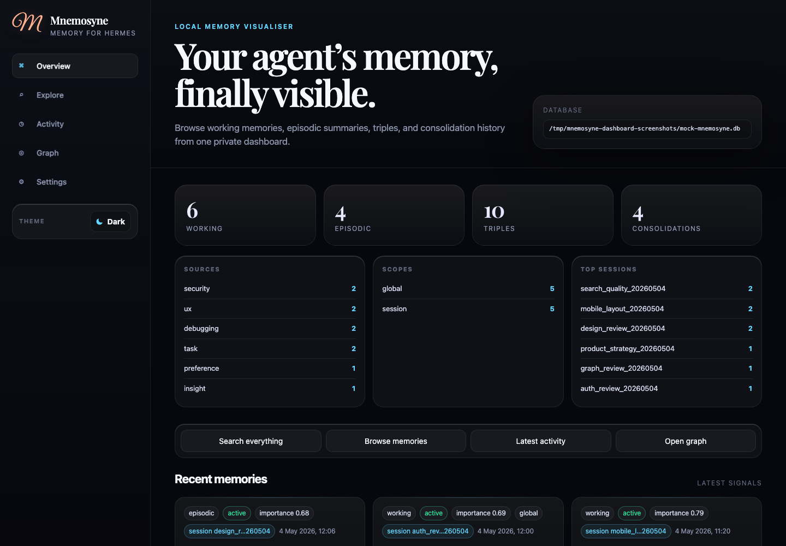
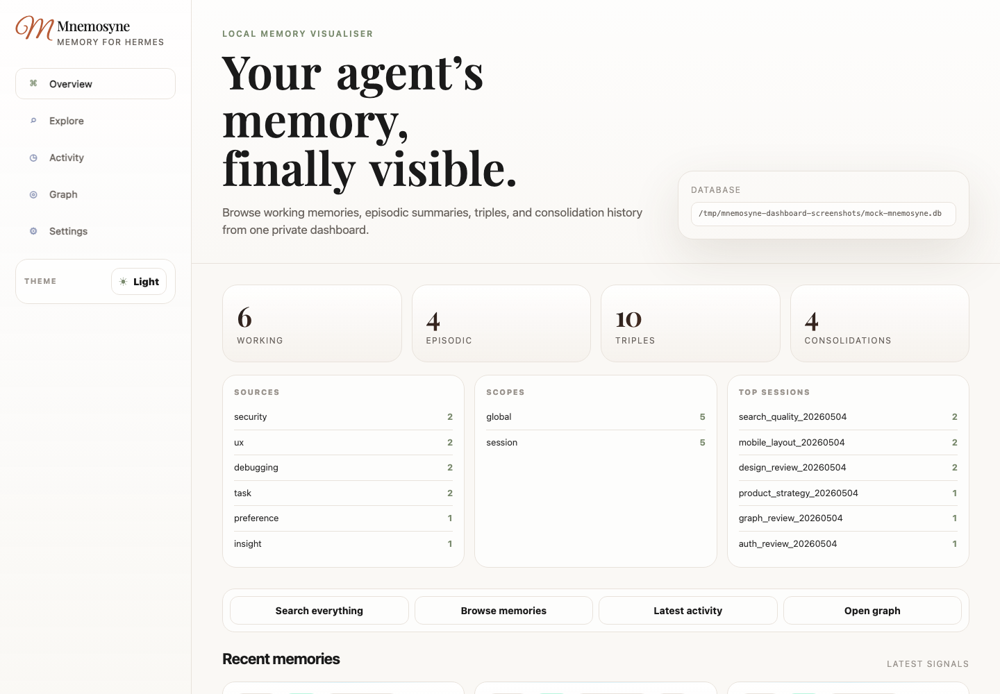
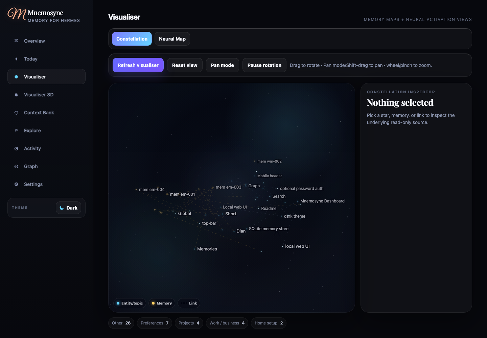
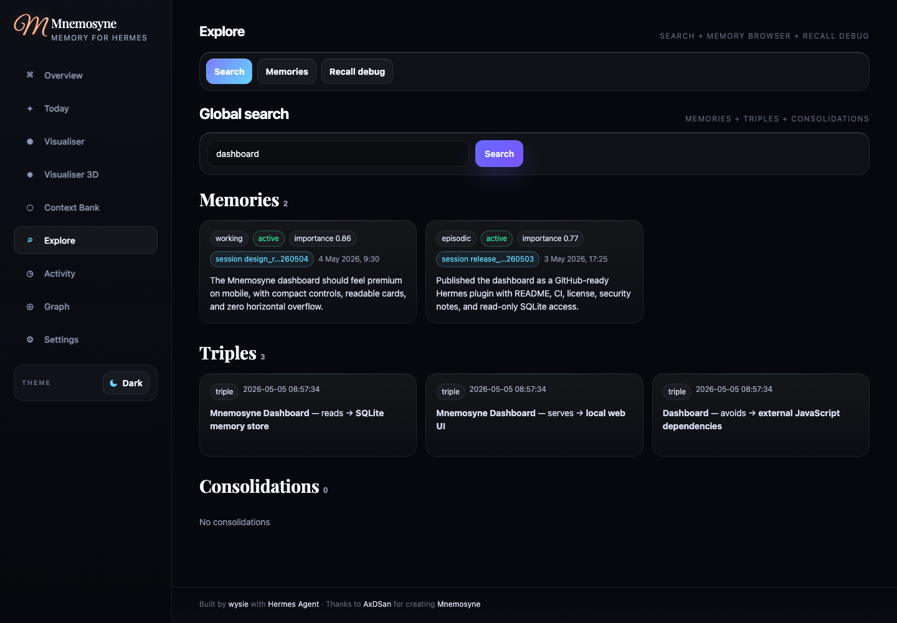
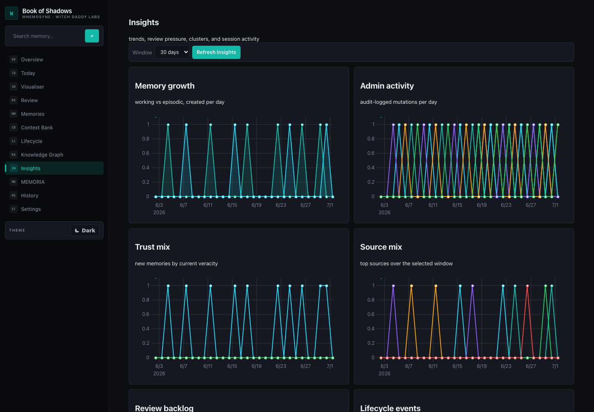
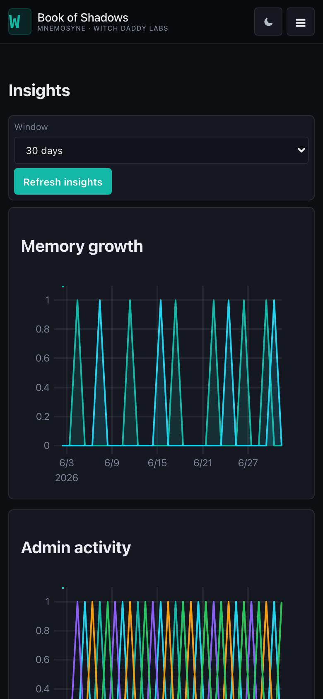
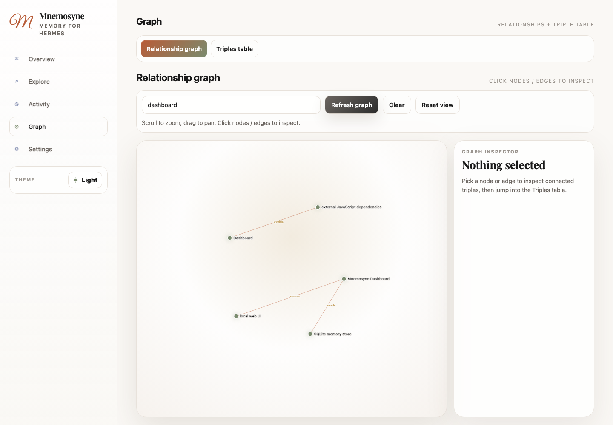
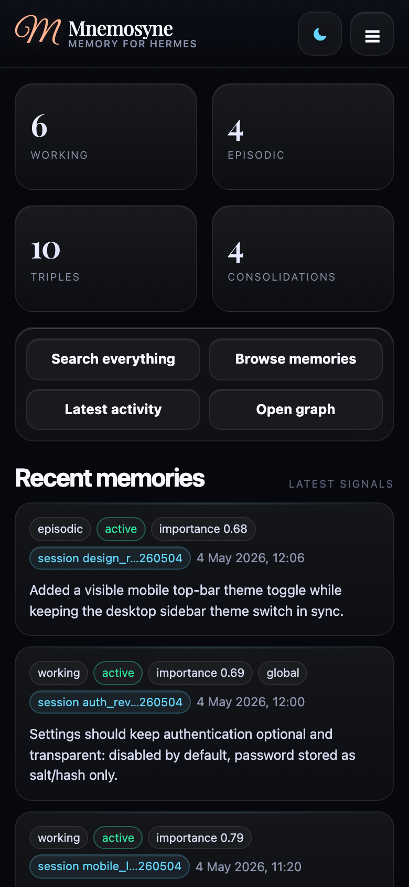

# Book of Shadows

**A cozy little window into your Hermes Agent's memory, by [Witch Daddy Labs](https://github.com/cre8tivoz).**

Your Hermes Agent remembers things about you — preferences, facts, whole conversations — in memory systems like Mnemosyne, MemPalace, Mem0, and Honcho. Book of Shadows is the dashboard that lets you actually *see* that memory: browse it, search across all your providers, watch it grow, and gently tidy it up when something's wrong. Everything runs on your own machine. Nothing leaves your network unless you want it to.



## Plays nicely with Hermes Agent

Book of Shadows is built as a plugin for [Hermes Agent](https://github.com/NousResearch/hermes-agent), the AI agent from Nous Research that remembers you across conversations and can be extended with plugins like this one. If you're already running Hermes, it drops straight in — a couple of commands in your terminal, and you've got a dashboard for the memory your agent has been quietly building up.

You don't *have* to be running Hermes to use it, either — point it at any compatible memory store and it'll happily run standalone. But the two were made for each other.

## What is this, really?

Under the hood it's intentionally small and boring, in the best way: a plain Python server with no heavy framework, and a static HTML/CSS/JS frontend with no sprawling dependency tree. When you open it, it reads your memory databases in **read-only** mode by default — nothing gets touched just by browsing. If you want to make changes, you can turn on an optional password-protected admin mode, and even then it can never hard-delete anything or overwrite content. The most it can do is mark something as expired, retire a duplicate, or nudge how important a memory is — and every one of those actions gets backed up and logged automatically.

## Multi-Provider Memory

Book of Shadows now supports **four memory providers** through a unified adapter layer:

| Provider | Glyph | Color | Storage | Graph | Timeline |
|----------|-------|-------|---------|-------|----------|
| **Mnemosyne** | 🧠 | Purple | Local SQLite | ✅ | ✅ |
| **MemPalace** | 🏰 | Amber | Local SQLite + JSON | ✅ | ✅ |
| **Mem0** | ☁️ | Blue | Cloud / Self-hosted | ❌ | ❌ |
| **Honcho** | 🪞 | Pink | Cloud (peer model) | ✅ | ❌ |

The dashboard auto-detects which providers are available and shows tabs for each active one. You can search across all providers at once or scope to a specific one.

### Provider Features

- **Cross-Search** — Search all your memory providers with one query, results grouped by source with provenance labels
- **Unified Timeline** — Merge temporal data from every provider into a single reverse-chronological feed
- **Peer Visualiser** — For Honcho users, a 2D ring view showing peer nodes connected by representation edges

## Themes

Dark mode uses iron-charcoal surfaces with teal accents. Light mode is warm bone with dark teal. Both are easy on the eyes for late-night tinkering sessions.



## What you can do with it

- **Overview** — the big picture: how many memories you have, what kind, what's been happening lately
- **Provider Tabs** — segmented control at the top for switching between active memory providers
- **Provider Sidebar** — status cards showing health, memory count, and connection status for each provider
- **Today** — a friendly daily digest of what got added, recalled, or tidied up
- **Context Bank** — the patterns and context your agent has picked up about you
- **Insights** — operational charts and cards for growth, audit activity, trust mix, sources, review backlog, lifecycle events, clusters, and session heat
- **Visualiser** — a constellation/neural-map/peer view of your memories you can click through and explore
- **Visualiser 3D** — the same idea, rendered in 3D, for the GPU-curious
- **Global Search** — search across all providers with provider filter chips
- **Unified Timeline** — merged chronological feed from all providers with date headers and provider badges
- **Memories** — the full browser: search, filter, sort, bulk-tidy, debug recall
- **History** — a timeline of everything, grouped by day or by conversation
- **Knowledge Graph** — the facts and relationships your agent has extracted, as an actual graph you can click around
- **MEMORIA** — structured facts, timelines, instructions, and preferences it's learned about you
- **Settings** — password protection, server setup, health diagnostics, backups

## Getting it running

If you're already on Hermes, this is the easy path:

```bash
hermes plugins install cre8tivoz/mnemosyne-dashboard --enable
hermes gateway restart
```

That's it — Hermes handles the rest, and the dashboard will be ready the next time you open your gateway.

Prefer to do it by hand? That works too:

```bash
git clone https://github.com/cre8tivoz/mnemosyne-dashboard.git ~/.hermes/plugins/mnemosyne-dashboard
hermes plugins enable mnemosyne-dashboard
hermes gateway restart
```

## Running it on its own

No Hermes install handy? You can run the dashboard directly:

```bash
python server.py --host 0.0.0.0 --port 8765
```

Then open `http://127.0.0.1:8765/` in your browser and you're in.

### Provider Setup

Each provider auto-detects its configuration:

- **Mnemosyne** — reads from `~/.hermes/mnemosyne/data/mnemosyne.db` (or `MNEMOSYNE_DB_PATH` env var)
- **MemPalace** — reads from `~/.mempalace/config.json` (or `MEMPALACE_DIR` env var)
- **Mem0** — reads `MEM0_API_KEY` from env, `$HERMES_HOME/.env`, or `$HERMES_HOME/mem0.json`
- **Honcho** — reads `HONCHO_API_KEY` from env, `~/.hermes/honcho.json`, or `~/.honcho/config.json`

## API Endpoints

The dashboard exposes a REST API for all operations:

### Provider Endpoints
- `GET /api/providers` — active providers + capabilities
- `GET /api/health` — per-provider health + dashboard health
- `GET /api/<provider>/{memories,graph,timeline,counts}` — per-provider reads

### Cross-Provider Endpoints
- `GET /api/search?q=&providers=` — cross-provider search with optional filtering
- `GET /api/timeline?limit=` — unified reverse-chronological timeline

### Mnemosyne-Specific Endpoints
- `GET /api/stats`, `/api/memories`, `/api/graph`, `/api/triples`
- `GET /api/insights/*` — growth, audit, trust mix, sources, lifecycle
- `GET /api/review`, `/api/lifecycle`, `/api/profile/inferred`
- `POST /api/admin/memory/{invalidate,importance,veracity,expiry,supersede}` — admin mutations

## Your memories are safe with this thing

We built this so you could hand it to someone nervous about "an app touching my data" and watch them relax:

- It's reachable from other devices on your home network by default (handy for checking in from your phone), but it never reaches out anywhere beyond that
- Browsing your memories opens the database in strict read-only mode — the dashboard *cannot* write to it just because you're looking around
- Turning on admin mode requires a password you choose yourself, and it's switched off by default
- Even in admin mode, the only actions available are marking something superseded or expired, or adjusting its importance — there's no delete button, and no way to overwrite content
- Every admin action is automatically backed up and written to an audit log, so you can always see what changed
- Standard web-security headers are all in place — no clickjacking, no content-type sniffing tricks, a sensible referrer policy
- The server only ever serves files from its own `static/` folder, so there's no sneaking outside it
- **SSRF protection** — provider `base_url` parameters are validated against an allowlist of known-good endpoints
- **Content-Type validation** — POST endpoints reject non-JSON bodies with `415 Unsupported Media Type`
- **ReDoS protection** — regex patterns are limited to 100 characters to prevent catastrophic backtracking
- **Persistent rate limiting** — login attempts are tracked in a file that survives server restarts
- **Configurable Secure cookie** — `cookie_secure: true` enables the `Secure` flag on auth cookies

## Screenshots

All screenshots are generated from a temporary fictional database and audit log. The current gallery source of truth is [docs/screenshots/manifest.json](docs/screenshots/manifest.json), which records the generated timestamp, covered tabs, themes, and viewport sizes.

|  |  |
|---|---|
| Dark theme overview | Light theme overview |

|  |  |
|---|---|
| Constellation visualiser | Search results |

|  |  |
|---|---|
| Insights charts | Mobile insights |

|  |  |
|---|---|
| Knowledge graph (light theme) | Mobile dark overview |

Want to regenerate the whole gallery yourself? One command, using the same mock data:

```bash
/Users/habibi/.local/bin/uv run --with websocket-client --python /Users/habibi/.local/bin/python3.11 python scripts/generate_mock_screenshots.py
```

More detail lives in [docs/DEMO_DATA.md](docs/DEMO_DATA.md).

## Tinkering on the code

Want to poke around under the hood or send a fix? Welcome aboard — here's how to check your work before opening a PR:

```bash
python -m pytest tests/ -q
python -m ruff check .
python -m compileall -q .
```

### Running Tests

```bash
# All tests
python -m pytest tests/ -q

# Specific test files
python -m pytest tests/providers/test_mem0.py -q
python -m pytest tests/test_p3.py -q

# With coverage
python -m pytest tests/ --cov=providers --cov=server -q
```

### Linting

```bash
python -m ruff check .
python -m ruff check --fix .
```

## Architecture

```
providers/
├── base.py           # MemoryProvider ABC, PeerProvider mixin, dataclasses
├── mnemosyne.py      # Mnemosyne adapter (SQLite)
├── mempalace.py      # MemPalace adapter (SQLite + JSON, AAAK decompression)
├── mem0.py           # Mem0 adapter (cloud/OSS SDK)
├── honcho.py         # Honcho adapter (peer/session model)
└── registry.py       # Provider discovery, initialization, routing

paths.py              # Cross-platform Hermes home resolution
server.py             # HTTP server with registry-backed routing
config.py             # DashboardConfig, auth, password hashing
dashboard_core.py     # SQLite read logic, search, graph, timeline
```

### Provider Adapter Pattern

Every adapter implements the `MemoryProvider` ABC:

```python
class MemoryProvider(ABC):
    def initialize() -> ProviderHealth
    def query(search, limit) -> list[Row]
    def get_counts() -> dict[str, int]
    def get_graph_edges(limit) -> list[Edge] | None
    def get_timeline(limit) -> list[TimelineEntry] | None
    def capabilities() -> ProviderCapabilities
```

Honcho extends this with `PeerProvider` for peer/session-specific methods.

## Cross-Platform

Book of Shadows works on macOS, Linux, and Windows:

- **macOS/Linux:** `~/.hermes/`
- **Windows:** `%LOCALAPPDATA%\hermes\`

CI runs on `ubuntu-latest`, `macos-latest`, and `windows-latest` with Python 3.11 and 3.12.

## Credits

- **Design** — Witch Daddy Labs
- **Original dashboard** — [wysie](https://github.com/wysie)
- **Mnemosyne, the memory engine this reads from** — [AxDSan](https://github.com/AxDSan)
- **Built to plug into** — [Hermes Agent](https://github.com/NousResearch/hermes-agent) by Nous Research

Thanks to everyone building the ecosystem this sits on top of.
